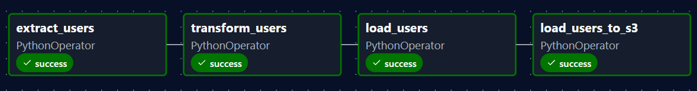
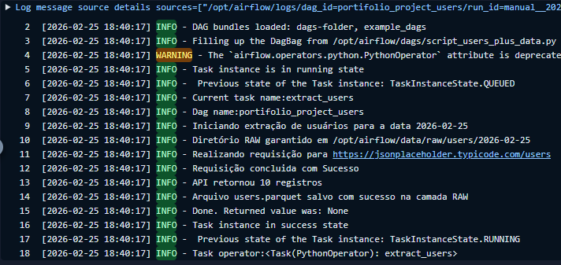

# Airflow ETL Pipeline – Users

Este projeto implementa um pipeline ETL simples utilizando Apache Airflow, com execução diária baseada em `execution_date` e particionamento de dados por data.

O objetivo é demonstrar boas práticas fundamentais de engenharia de dados aplicadas a pipelines batch.

---

## 📌 Objetivo do Projeto

- Automatizar a execução de um pipeline ETL
- Utilizar `execution_date` como eixo central do processamento
- Organizar dados por partição temporal
- Garantir idempotência e possibilidade de reprocessamento

Este projeto foi desenvolvido para fins de estudo e portfólio.


---
 
## 🏗 Arquitetura de Dados

```text
data/
├── raw/
│   └── users/
│       └── YYYY-MM-DD/
│           └── users.parquet
└── processed/
    └── users/
        └── YYYY-MM-DD/
            └── users.parquet
```

---

## 🔄 Fluxo do Pipeline

### 1. Extract
- Executa diariamente conforme o schedule da DAG
- Processa dados referentes à `execution_date`
- Persiste os dados brutos particionados por data

### 2. Transform
- Lê os dados da camada raw da mesma `execution_date`
- Aplica transformação simples de enriquecimento
- Persiste os dados na camada processed mantendo o particionamento

### 3. Load
- Lê os dados da camada `processed` referentes à `execution_date`
- Realiza o carregamento para a camada final (analytics / target)
- Garante idempotência do processo (reprocessamentos não geram duplicidade)
- Disponibiliza os dados prontos para consumo analítico

---

## 🖼 Imagem do Fluxo do Pipeline



---

## ⏱ Agendamento

- Schedule: `@daily`
- Pipeline baseado em período lógico, não no horário real da execução

Esse modelo permite:
- Reprocessamento
- Backfill
- Retries seguros
- Rastreabilidade temporal

---

## 🧠 Conceitos Aplicados

- Apache Airflow
- DAGs e PythonOperator
- `execution_date`
- Particionamento por data
- Idempotência
- ETL batch
- Organização de Data Lake (raw / processed)

---

## 🚀 Possíveis Evoluções

- Persistência em S3 ou GCS
- Validações de qualidade de dados
- Versionamento de schema
- Logs estruturados
- Backfill documentado

---

## 📎 Observações

Este repositório contém apenas a lógica da DAG.  
Pressupõe-se a existência de um ambiente Apache Airflow previamente configurado (ex: via Docker).

---

## 🆕 Atualização Recente

Adicionados logs estruturados em todas as etapas do pipeline (extract, transform e load), permitindo maior observabilidade, rastreabilidade e diagnóstico de falhas

Implementação de tratamento de erros e retries, garantindo maior resiliência do pipeline frente a falhas temporárias (API, filesystem ou upload para S3)

Logs padronizados seguindo boas práticas de engenharia de dados, facilitando monitoramento via UI do Airflow

Registro visual do fluxo de execução e mensagens de log para apoio à análise operacional

<p align="center">  </p>