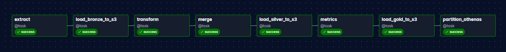

# Data Pipeline with Airflow, S3 and Athena

End-to-end data pipeline that ingests user data from the RandomUser API, processes it using a Medallion Data Architecture, and exposes analytical datasets through Amazon Athena.

The pipeline is orchestrated with Apache Airflow and stores data in an Amazon S3 Data Lake using partitioned Parquet datasets.

---

# Architecture



The pipeline follows the **Medallion Data Architecture**.

```
RandomUser API
│
▼
Apache Airflow
│
▼
Bronze Layer (Raw Data)
│
▼
Silver Layer (Cleaned Data)
│
▼
Gold Layer (Aggregated Metrics)
│
▼
Amazon Athena (Query Layer)

```

| Layer | Purpose |
|------|------|
| 🥉 Bronze | Raw data ingestion directly from the API |
| 🥈 Silver | Cleaned and structured datasets |
| 🥇 Gold | Aggregated metrics for analytics |

Benefits:

- Clear data lineage
- Separation between raw and curated data
- Scalable analytical datasets
- Easier debugging and maintenance

---

# Tech Stack

- Apache Airflow — pipeline orchestration
- Python — data processing
- Amazon S3 — Data Lake storage
- Amazon Athena — analytical query engine
- Pandas — data transformation
- Parquet — columnar storage format

Data source:

- RandomUser API

---

# Project Structure

```
AIRFLOW-PROJECT/
│
├── dags/ # Airflow DAG definitions
│
├── src/
│ ├── bronze/ # Raw ingestion layer
│ │ └── extract.py
│ │
│ ├── silver/ # Data cleaning & transformation
│ │ └── transform.py
│ │ └── incremental_merge.py
│ │
│ ├── gold/ # Analytical metrics generation
│ │ └── metrics.py
│ │
│ ├── load/ # S3 upload logic
│ │ ├── load_bronze_s3.py
│ │ ├── load_silver_s3.py
│ │ └── load_gold_s3.py
│ │
│ └── athena/
│ └── register_partition.py
│
├── tests/
│ └── test_transform.py
│
├── docker-compose.yaml
├── requirements.txt
└── README.md
```

---

# Data Lake Storage (Amazon S3)

Datasets are stored in Amazon S3 following the Medallion structure.

```
s3://vinicius-airflow-data-lake/

bronze/
users/

silver/
users/

gold/
users/

athena-results/
```

All datasets are stored in **Parquet format**, providing:

- better compression
- faster analytical queries
- compatibility with engines such as Athena or Spark

---

# Partitioning Strategy

Datasets are partitioned by execution date.

Example:

```
gold/users/date=2026-03-09/users.parquet
```

Benefits:

- faster Athena queries
- reduced scanned data
- historical dataset versioning
- scalable Data Lake structure

---

# Incremental Processing

The pipeline processes data based on the **execution date**, generating a new dataset for each run.

```
date=YYYY-MM-DD
```

Each execution produces an isolated snapshot stored in the Data Lake.

This simulates a real-world incremental ingestion strategy commonly used in production pipelines.

---

# Query Layer (Amazon Athena)

Amazon Athena enables SQL queries directly on top of the S3 Data Lake.

Example query:

```
SELECT *
FROM users
WHERE date = '2026-03-09';
```

During pipeline execution:

1. Gold datasets are written to S3  
2. A partition is registered in Athena  
3. Data becomes immediately queryable

---

# Orchestration (Apache Airflow)

The pipeline is orchestrated with Apache Airflow.

Main responsibilities:

- DAG scheduling
- task dependency management
- retry mechanisms
- execution monitoring
- task-level logging

---

# Running the Pipeline

Start the Airflow environment:

```
docker compose up -d
```

Access Airflow UI:

```
http://localhost:8080
```

Then:

1. Enable the DAG
2. Trigger a pipeline run
3. Monitor execution through Airflow logs

---

# Engineering Concepts Demonstrated

- Apache Airflow orchestration
- Medallion Data Architecture
- Incremental ingestion
- Data Lake design
- Partitioned datasets
- Parquet-based storage
- Amazon Athena query layer
- Modular pipeline architecture
- Logging and observability
- Dockerized development environment

---

# Future Improvements

- Data quality validation
- AWS Glue Data Catalog integration
- Metadata tracking
- CI/CD for pipeline validation
- Infrastructure as Code
- Dashboard layer for analytics

---

# Author

Vinicius Santos

Data Engineering enthusiast focused on building production-oriented data pipelines and scalable data architectures.